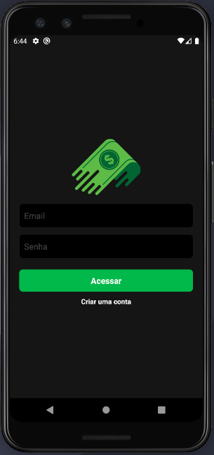
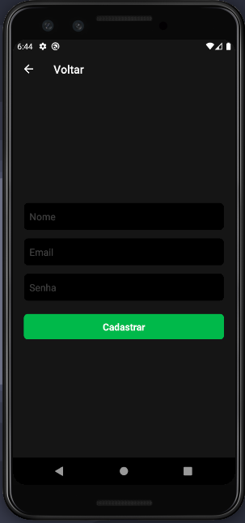
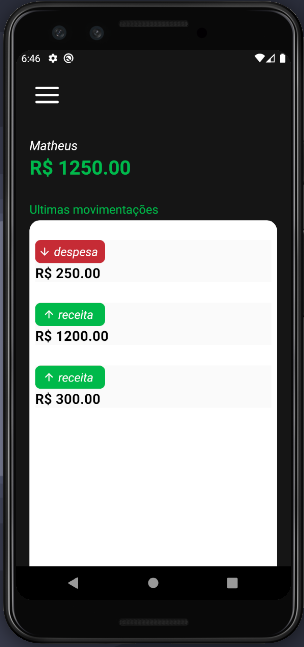
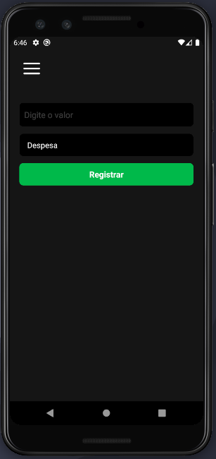
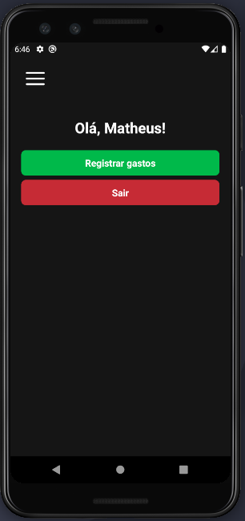
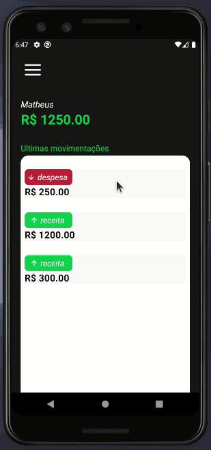

<div id="top"></div>
<!--
*** Thanks for checking out the Best-README-Template. If you have a suggestion
*** that would make this better, please fork the repo and create a pull request
*** or simply open an issue with the tag "enhancement".
*** Don't forget to give the project a star!
*** Thanks again! Now go create something AMAZING! :D
-->

<!-- PROJECT SHIELDS -->
<!--
*** I'm using markdown "reference style" links for readability.
*** Reference links are enclosed in brackets [ ] instead of parentheses ( ).
*** See the bottom of this document for the declaration of the reference variables
*** for contributors-url, forks-url, etc. This is an optional, concise syntax you may use.
*** https://www.markdownguide.org/basic-syntax/#reference-style-links
-->

<!-- PROJECT LOGO -->
<br />
<div align="center">
  <a src="https://github.com/matheuslima99/app_financas">
    
  </a>

<h3 align="center">Finanças App - React Native</h3>

  <p align="center">
    Consumindo banco de dados Firebase e usando React Native
    <br />


<!-- TABLE OF CONTENTS -->
<details open="open">
  <summary>Table of Contents</summary>
  <ol>
    <li>
      <a href="#about-the-project">About The Project</a>
      <ul>
        <li><a href="#built-with">Built With</a></li>
      </ul>
    </li>
    <li>
      <a href="#getting-started">Getting Started</a>
      <ul>
        <li><a href="#installation">Installation</a></li>
      </ul>
    </li>
    <li><a href="#usage">Usage</a></li>
    <li><a href="#contributing">Contributing</a></li>
    <li><a href="#contact">Contact</a></li>
  </ol>
</details>

<!-- ABOUT THE PROJECT -->

## About the Project

 <a href="https://github.com/matheuslima99/app_financas">
    
    
    
    
     
  </a>

Foi contruído um aplicativo utilizando React Native como framework e o Firebase como bd para armazenar os dados da aplicação.

<p align="right">(<a href="#top">voltar ao topo</a>)</p>

### Built With

- [React Native](ttps://reactnative.dev/)
- [FIrebase](https://firebase.google.com/)
- [Async Storage](https://reactnative.dev/docs/asyncstorage)
- [React Navigation](https://reactnavigation.org/)
- [Styled Components](https://styled-components.com/)
- [React Native Vector Icons](https://github.com/oblador/react-native-vector-icons)
- [Date fns](https://date-fns.org/)

<p align="right">(<a href="#top">voltar ao topo</a>)</p>

<!-- GETTING STARTED -->

## Getting Started

Para começar, você deve ter instalado e configurado o NodeJs em seu sistema operacional para abri-lo no emulador para Android ou simulador para IOS.

### Installation

1. Clone the repo
   ```sh
   git clone https://github.com/matheuslima99/app_financas
   ```
2. Install NPM packages
   ```sh
   npm install or yarn add
   ```
3. To iOS install pods with command`
   ```sh
   npx pod install
   ```
4. To run on device or emulator

   ```sh
   yarn android #to android
   ```

   ```sh
   yarn ios #to iOS
   ```

<!-- USAGE EXAMPLES -->

<p align="right">(<a href="#top">voltar ao topo</a>)</p>

<!-- USAGE EXAMPLES -->

## Usage

<p align="center">
    


 Ao abrir o aplicativo, o usuário terá a opção de logar ou se cadastrar. Uma vez cadastrado, o usuário poderá logar e registrar todos os seus gastos financeiros.

<p align="right">(<a href="#top">voltar ao topo</a>)</p>


<!-- CONTRIBUTING -->

## Contributing

As contribuições são o que torna a comunidade de código aberto um lugar incrível para aprender, inspirar e criar. Quaisquer contribuições que você fizer serão **muito bem apreciadas**.

1. Fork the Project
2. Create your Feature Branch (`git checkout -b feature/AmazingFeature`)
3. Commit your Changes (`git commit -m 'Add some AmazingFeature'`)
4. Push to the Branch (`git push origin feature/AmazingFeature`)
5. Open a Pull Request

<p align="right">(<a href="#top">voltar ao topo</a>)</p>

<!-- CONTACT -->

## Contact

Matheus lima - maths.soares99@gmail.com

Link do projeto: [https://github.com/matheuslima99/app_financas](https://github.com/matheuslima99/app_financas)

<p align="right">(<a href="#top">voltar ao topo</a>)</p>
